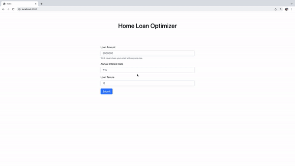

# Home Loan Optimizer UI
This project is the UI for the [Home Loan Optimizer](https://github.com/AxiomSamarth/home-loan-optimizer) project for better comprehension and visualization.

## Usage
For this to retreive the results, user should be running the [Home Loan Optimizer](https://github.com/AxiomSamarth/home-loan-optimizer) API (at localhost:8080). So, clone the API and get it running referring to its steps [here](https://github.com/AxiomSamarth/home-loan-optimizer#usage)

Once the above is satisfied

```
# clone this repository
git clone https://github.com/AxiomSamarth/home-loan-optimizer-ui.git

# navigate to the project folder
cd home-loan-optimizer-ui

# export a secret key (needed for http request sessions. 
# We can keep random secret key for experimentation)
export secret_key=SUPER_SECRET_KEY

# run the app.py
python3 app.py
```

It should start the process something like

```
python3 app.py
 * Serving Flask app "app" (lazy loading)
 * Environment: production
   WARNING: This is a development server. Do not use it in a production deployment.
   Use a production WSGI server instead.
 * Debug mode: off
 * Running on http://0.0.0.0:8000/ (Press CTRL+C to quit)
127.0.0.1 - - [28/Jan/2022 20:57:01] "POST /strategies HTTP/1.1" 200 -
```

On the browser when you visit http://localhost:8000, you should see something like below



## Version Matrix

The following UI Versions uses the corresponding API versions

| Home Loan Optimizer UI Version | Home Loan Optimizer API Version |
-|-|
v1.0.0|v1.0.0

## Contribution guidelines -

We are glad that you want to contribute to this project and make it better. Please refer to [contribution guidelines](./CONTRIBUTING.md) and follow the guidelines.